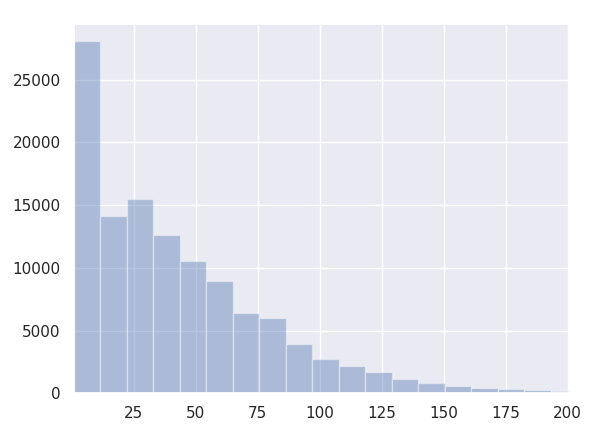

# Distribution of line lengths



## Dependencies

For resolve of dependencies use following command:

    pip3 install -r requirements

## Help

```
usage: line-length-distribution.py [-h] [--min MIN] [--max MAX]
                                   FILE [FILE ...]

Plots distribution of line lengths of text files.

positional arguments:
  FILE        text file

optional arguments:
  -h, --help  show this help message and exit
  --min MIN   minimum line length
  --max MAX   maximum line length
```